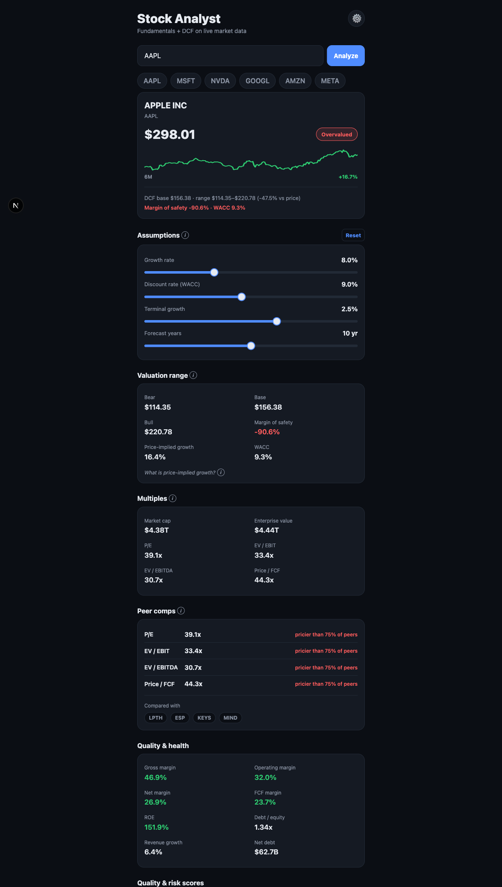
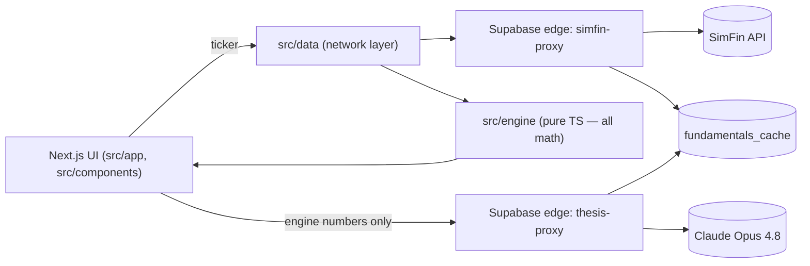

# Stock Analyst

A web app that turns a stock ticker into a rigorous, **trustworthy** fundamental analysis — metrics,
a multi-stage DCF valuation with a bear/base/bull range, quality & bankruptcy scores, peer comps, and
an AI investment thesis — all computed from **live market data**.

> **Live demo:** _add your Vercel URL here_ · educational tooling, **not investment advice**.



---

## Why this project is interesting

The hard problem with LLMs in finance is **trust**: models hallucinate numbers. This app is built around
one rule that makes the output dependable:

> **The LLM never does math.** Every figure — ratios, DCF value, WACC, scores — is produced by a pure,
> deterministic, unit-tested TypeScript engine. The AI layer only *reasons over and cites* those
> pre-computed numbers; it can never invent one. Structured output enforces the shape.

That single constraint is the spine of the architecture, and it shows in the output (every claim in the
AI thesis quotes engine figures like `ROE 151.9%`, `Piotroski 8/9`, `DCF base $156.38 vs price $298.01`).

## Features

- **Live fundamentals** for ~5,000 US stocks (SimFin), cached server-side per ticker.
- **Valuation engine:** multi-stage FCFF DCF with a **bear/base/bull range** + margin of safety,
  **reverse DCF** (the growth the current price implies), and **CAPM WACC**.
- **Quality & risk scores:** Piotroski F-Score (0–9), Altman Z″ (distress), Beneish M (earnings-manipulation flag).
- **Interactive assumptions:** drag growth/discount/terminal/horizon sliders and the valuation
  **recomputes instantly** through the pure engine — no network round-trip.
- **Peer comps:** percentile ranking of the target against sector peers on valuation multiples.
- **AI thesis (Claude Opus 4.8):** balanced bull/bear case, moat, risks, and a verdict — every point
  grounded in the engine's numbers. Works out of the box (shared key) with an optional bring-your-own-key.
- Price sparkline, plain-language glossary for every metric, skeleton loaders, graceful per-widget failure.

## Architecture

Two layers, strictly separated — which is the whole point:

1. **`src/engine/` — the durable asset.** Pure TypeScript (no React, no I/O). Same input → same output,
   locked by **44 unit tests**. This is where all math lives.
2. **`src/app/` + `src/components/` — the disposable UI.** Next.js App Router + React.

> **Proof the separation is real:** this started as a React Native / Expo app and was later **migrated to
> Next.js without changing a single line of `src/engine/`** (or its tests). The valuable core was fully
> portable; only the throwaway UI was rewritten.



All network/I-O lives only in `src/data/`; the engine stays pure and synchronous. The Supabase edge
functions hold every secret server-side and cache per ticker (not per user), which keeps data + LLM cost
flat as usage grows.

## Tech stack

| Layer | Choice |
|---|---|
| Frontend | Next.js 15 (App Router), React 19, TypeScript (strict), Tailwind CSS v4 |
| Engine | Pure TypeScript, tested with Vitest (44 tests) |
| Backend | Supabase Edge Functions (Deno) + Postgres cache |
| Data | SimFin (fundamentals + prices), FMP fallback |
| AI | Claude Opus 4.8 via the Anthropic API (structured output + adaptive thinking) |

## AI thesis: cost-safe by design

The thesis layer is built so a public demo can't run up a bill:

- **Shared key by default, BYOK override.** The Anthropic key is a **server-side Supabase secret** — never
  shipped to the browser. Anyone can generate a thesis with no setup; a user's own key (stored only in their
  browser) takes precedence and runs on their quota.
- **Per-ticker cache.** A generated thesis is cached per ticker, so repeat requests cost **$0**.
- **Daily cap.** Shared-key generations are capped per day (`THESIS_DAILY_CAP`); past the cap it falls back
  to BYOK. Both are tunable via Supabase secrets.

### Example output (AAPL, generated by the app)

> **Verdict: Bearish.** Apple is a high-quality, highly profitable business with elite returns on equity
> and strong financial health, but the stock trades at a steep premium to every DCF scenario, with the
> market pricing in growth far above its recent pace. The fundamentals are excellent; the valuation is the
> problem.
>
> *Bull — Elite profitability:* gross margin 46.9%, operating margin 32.0%, net margin 26.9%, ROE 151.9%.
> *Bear — Priced for perfection:* DCF base $156.38 vs price $298.01 → margin of safety −90.6%.

Every figure is quoted from the engine, never generated by the model.

## Local development

```bash
npm install
npm run dev        # → http://localhost:3000

npm test           # 44 engine unit tests (Vitest)
npm run build      # production build (also type-checks)
npx tsc --noEmit   # type-check only
```

Create `.env` (see `.env.example`) with the **public** Supabase client config:

```bash
NEXT_PUBLIC_SUPABASE_URL=https://<project>.supabase.co
NEXT_PUBLIC_SUPABASE_ANON_KEY=<anon-key>
```

Server-side secrets (SimFin/Anthropic keys, cost caps) live on the Supabase functions, never in the client:

```bash
supabase secrets set SIMFIN_API_KEY=… ANTHROPIC_API_KEY=… THESIS_DAILY_CAP=200 --project-ref <ref>
supabase functions deploy simfin-proxy thesis-proxy --project-ref <ref>
```

## Deployment

The frontend is a standard Next.js app — deploy to **Vercel** with zero config:

```bash
npx vercel            # first deploy (links the project)
npx vercel --prod     # production
```

Set `NEXT_PUBLIC_SUPABASE_URL` and `NEXT_PUBLIC_SUPABASE_ANON_KEY` as Vercel project env vars. The
backend (Supabase edge functions) is deployed independently and needs no change.

## Disclaimer

Educational tooling only — **not investment advice**, and not a recommendation to buy or sell any security.
